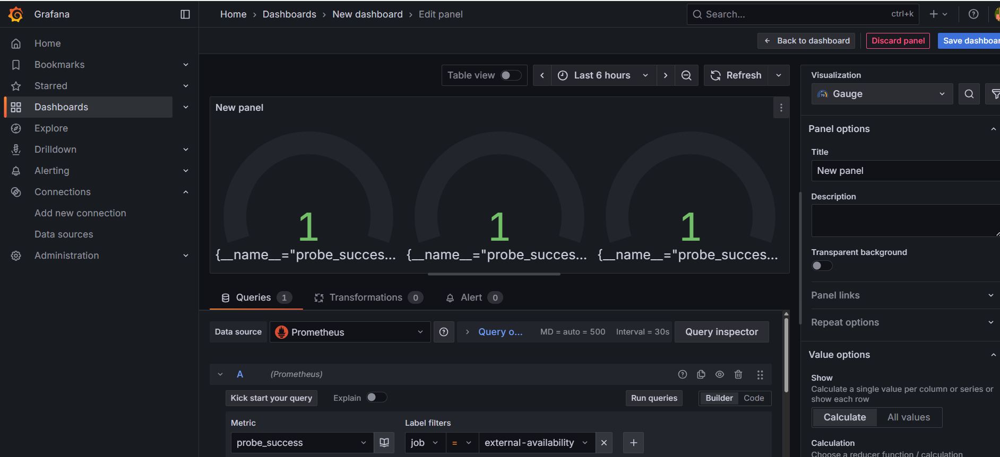

# Super Mario on Kubernetes with Terraform, Prometheus & Grafana
## Project Overview
This project demonstrates how to deploy the Super Mario game on Amazon EKS using Terraform (Infrastructure as Code) and extend it with end-to-end monitoring.

## Key highlights:
-Infrastructure provisioned with Terraform

-App deployed on Kubernetes (EKS)

-Prometheus + Blackbox Exporter + Grafana added for observability

-Created ServiceMonitor for Mario uptime & latency

-Added external probes for real-world services like GitHub, LinkedIn, and Kubernetes.io

-Simulated failure (breaking Mario) and validated monitoring by watching dashboards flip red and recover green

## Business Relevance:
-Monitoring is mission-critical across gaming, finance, healthcare, e-commerce.

-This lab shows how to combine IaC, container orchestration, and observability into a workflow that mirrors real-world SRE practices.

## Tools & Technologies
-AWS → EC2 (bastion host), S3 (Terraform backend), EKS (Kubernetes)

-Terraform → IaC for provisioning

-Kubernetes (kubectl) → app management

-Prometheus + Blackbox Exporter → metrics, probes, uptime checks

-Grafana → dashboards & visualisation

## Step-by-Step Implementation
**0️. Cloned the Repository**

-First, I cloned the project files to my EC2 instance:

git clone https://github.com/folaramide/Deployment-of-super-Mario-on-Kubernetes-using-terraform.git

cd Deployment-of-super-Mario-on-Kubernetes-using-terraform

**1️. Setup Environment**

-Provisioned an Ubuntu EC2 instance, install dependencies:

sudo apt update -y

sudo apt install -y docker.io unzip curl wget terraform

-Installed AWS CLI & kubectl:

curl "https://awscli.amazonaws.com/awscli-exe-linux-x86_64.zip" -o "awscliv2.zip"

unzip awscliv2.zip

sudo ./aws/install

curl -LO "https://dl.k8s.io/release/$(curl -L -s https://dl.k8s.io/release/stable.txt)/bin/linux/amd64/kubectl"

sudo install -o root -g root -m 0755 kubectl /usr/local/bin/kubectl

**2️. Terraform EKS Cluster**

-Created an S3 bucket:

aws s3 mb s3://mariof1bucket --region us-east-1

-Initialised and applied Terraform:

•	cd Deployment-of-super-Mario-on-Kubernetes-using-terraform/EKS-TF

•	terraform init

•	terraform apply -auto-approve

**3️. Deployed Mario Game**

aws eks update-kubeconfig --name EKS_CLOUD --region ap-south-1

kubectl apply -f deployment.yaml

kubectl apply -f service.yaml

kubectl get svc mario-service

-Accessed Mario via the LoadBalancer URL.

**4. Installed Prometheus + Grafana + Blackbox**

helm repo add prometheus-community https://prometheus-community.github.io/helm-charts

helm repo update

helm install prometheus prometheus-community/kube-prometheus-stack

helm install blackbox prometheus-community/prometheus-blackbox-exporter

Exposed services:

kubectl patch svc prometheus-grafana -n default -p '{"spec": {"type": "LoadBalancer"}}'

kubectl patch svc prometheus-kube-prometheus-prometheus -n default -p '{"spec": {"type": "LoadBalancer"}}'

**5️. Monitoring Configs**

•	Mario ServiceMonitor:

•	kubectl apply -f service-monitor.yaml

•	External Probes (GitHub, LinkedIn, Kubernetes.io):

•	kubectl apply -f external-probes.yaml

**6️. Key Prometheus Queries**

**Mario uptime:**

probe_success{service="mario-service"}

**External site uptime:**

probe_success{job="external-availability"}

**Latency:**

probe_duration_seconds

**7️. Grafana Dashboards**

-Mario App → uptime gauge, latency graph

-External Websites → GitHub/LinkedIn/Kubernetes.io uptime + latency

**8️. Break & Fix Demo**
**-Break Mario:**

kubectl scale deployment mario-deployment --replicas=0

Grafana → uptime returns "No Data", replicas = 0.

**-Fix Mario:**

kubectl scale deployment mario-deployment --replicas=2

Grafana → uptime green, replicas = 2.

## Business Impact
1. Gaming → ensures uptime for smooth player experience.
2. Finance → monitors latency & availability of trading endpoints.
3. Healthcare → guarantees availability of patient portals.
4. E-commerce → detects outages early to avoid lost sales.

By monitoring both internal apps (Mario) and external dependencies (GitHub, LinkedIn, Kubernetes.io), this lab mirrors real-world observability setups where businesses rely on multiple critical services.

## Cleanup
kubectl delete svc mario-service

kubectl delete deployment mario-deployment

cd EKS-TF

terraform destroy --auto-approve
